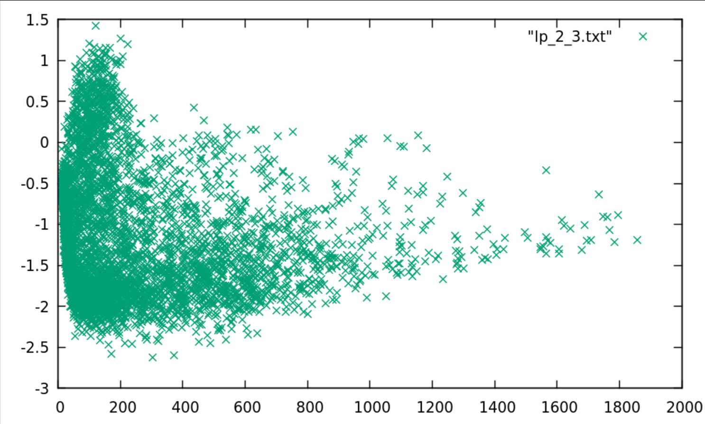
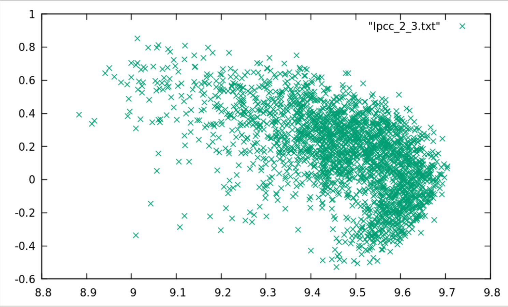
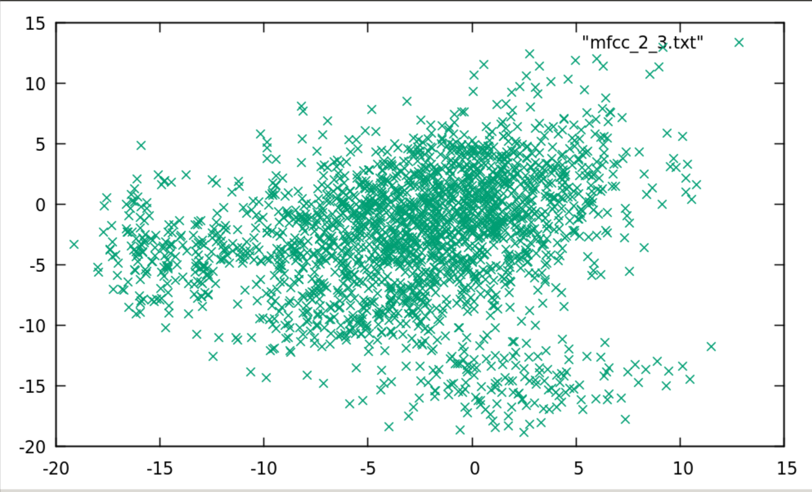

PAV - P4: reconocimiento y verificación del locutor
===================================================

Obtenga su copia del repositorio de la práctica accediendo a [Práctica 4](https://github.com/albino-pav/P4)
y pulsando sobre el botón `Fork` situado en la esquina superior derecha. A continuación, siga las
instrucciones de la [Práctica 2](https://github.com/albino-pav/P2) para crear una rama con el apellido de
los integrantes del grupo de prácticas, dar de alta al resto de integrantes como colaboradores del proyecto
y crear la copias locales del repositorio.

También debe descomprimir, en el directorio `PAV/P4`, el fichero [db_8mu.tgz](https://atenea.upc.edu/pluginfile.php/3145524/mod_assign/introattachment/0/spk_8mu.tgz?forcedownload=1)
con la base de datos oral que se utilizará en la parte experimental de la práctica.

Como entrega deberá realizar un *pull request* con el contenido de su copia del repositorio. Recuerde
que los ficheros entregados deberán estar en condiciones de ser ejecutados con sólo ejecutar:

~~~~~~~~~~~~~~~~~~~~~~~~~~~~~~~~~~~~~~~~~~~~~~~~~~~~~.sh
  make release
  run_spkid mfcc train test classerr verify verifyerr
~~~~~~~~~~~~~~~~~~~~~~~~~~~~~~~~~~~~~~~~~~~~~~~~~~~~~

Recuerde que, además de los trabajos indicados en esta parte básica, también deberá realizar un proyecto
de ampliación, del cual deberá subir una memoria explicativa a Atenea y los ficheros correspondientes al
repositorio de la práctica.

A modo de memoria de la parte básica, complete, en este mismo documento y usando el formato *markdown*, los
ejercicios indicados.

## Ejercicios.

### SPTK, Sox y los scripts de extracción de características.

- Analice el script `wav2lp.sh` y explique la misión de los distintos comandos, y sus opciones, involucrados
  en el *pipeline* principal (`sox`, `$X2X`, `$FRAME`, `$WINDOW` y `$LPC`).

  *sox: es un programa que sirve para generar una señal del formato adecuado a partir de una señal con otro formato, por ejemplo WAVE.*
  *$X2X: es el programa de SPTK que permite la conversión entre distintos formatos de datos.*
  *$FRAME: es un programa en el cual le entra una señal y te devuelve a la salida la misma señal dividida en tramas de L muestras tomadas con un desplazamiento de P muestras.* 
  *$WINDOW: es un programa que multiplica cada trama por la ventana Blackman.*
  *$LPC: es un programa que calcula los lpc_order primeros coeficientes de predicción lineal, precedidos por el factor de ganancia del predictor*

- Explique el procedimiento seguido para obtener un fichero de formato *fmatrix* a partir de los ficheros
  de salida de SPTK (líneas 41 a 47 del script `wav2lp.sh`).

*Para los ficheros de formato fmatrix necesitamos almacenar en cada fila una trama de la señal y a cada columna uno de los coeficientes con los que se parametriza la trama. Por eso es conveniente que primero se indique el número de filas y columnas. Por lo tanto ncol en el código se saca del número de coef del predictor lineal que es igual a uno más el orden, ya que el primer elemento del vector se almacena la ganancia de la señal: "ncol=$((lpc_order+1))". La obtención del número de filas es un poco más complicada, ya que depende de la longitud de la señal, la longitud y desplazamiento de la ventana, y la cadena de comandos que se ejecutan para obtener la parametrización. Por todo ello, es mejor, simplemente, extraer esa información del fichero obtenido. Lo hacemos convirtiendo la señal parametrizada a texto, usando sox +fa, y contando el número de líneas, con el comando de UNIX wc -l.*

  * ¿Por qué es conveniente usar este formato (u otro parecido)?

  *Es conveniente el uso de este formato ya que nos permite visualizar fácilmente el contenido del fichero. Además también permite seleccionar columnas o filas concretas de la matriz y trabajar, por tanto, por tramas o coeficientes del LPC.*

- Escriba el *pipeline* principal usado para calcular los coeficientes cepstrales de predicción lineal
  (LPCC) en su fichero <code>scripts/wav2lpcc.sh</code>:

~~~~~~~~~~~~~~~~~~~~~~~~~~~~~~~~~~~~~~~~~~~~~~~~~~~~~.sh		
sox $inputfile -t raw - dither -p12 | $X2X +sf | $FRAME -l 240 -p 80 | $WINDOW -l 240 -L 240 | $LPC -l 240 -m $lpc_order | $LPC2C -m $lpc_order -M $nceps > $base.lpcc
~~~~~~~~~~~~~~~~~~~~~~~~~~~~~~~~~~~~~~~~~~~~~~~~~~~~~

- Escriba el *pipeline* principal usado para calcular los coeficientes cepstrales en escala Mel (MFCC) en
  su fichero <code>scripts/wav2mfcc.sh</code>:

~~~~~~~~~~~~~~~~~~~~~~~~~~~~~~~~~~~~~~~~~~~~~~~~~~~~~.sh
sox $inputfile -t raw | $X2X +sf | $FRAME -l 240 -p 80 |$WINDOW -l 240 -L 240| $MFCC -l 240 -m $mfcc_order -s 8 -n $ncoef  -w 1 > $base.mfcc
~~~~~~~~~~~~~~~~~~~~~~~~~~~~~~~~~~~~~~~~~~~~~~~~~~~~~

### Extracción de características.

- Inserte una imagen mostrando la dependencia entre los coeficientes 2 y 3 de las tres parametrizaciones
  para una señal de prueba.

**LPC**
  

**LPCC**
  

**MFCC**
  
  
  + ¿Cuál de ellas le parece que contiene más información?

*De las tres representaciones la que da más información es la de los mel-cepstrums, porque tiene coeficientes más incorrelados lo que hará que con mla misma cantidad de datos haya menos redundancia por lo tanto más información. Además cabe destacar que la escala Mel esta pensada para dar más importancia a las frecuencias más relevantes basadas en la percepción del sistema auditivo humano.*

- Usando el programa <code>pearson</code>, obtenga los coeficientes de correlación normalizada entre los
  parámetros 2 y 3, y rellene la tabla siguiente con los valores obtenidos.

  |                        | LP   | LPCC | MFCC |
  |------------------------|:----:|:----:|:----:|
  | &rho;x[2,3] |      |      |      |
  
  + Compare los resultados de <code>pearson</code> con los obtenidos gráficamente.
  
- Según la teoría, ¿qué parámetros considera adecuados para el cálculo de los coeficientes LPCC y MFCC?

*Según la teoria los mejores valores para el LPCC son 19 para el orden y 26 para los coeficientes.*

~~~~~~~~~~~~~~~~~~~~~~~~~~~~~~~~~~~~~~~~~~~~~~~~~~~~~.sh
EXEC="wav2lpcc 19 26 $db/$filename.wav $w/$FEAT/$filename.$FEAT"
~~~~~~~~~~~~~~~~~~~~~~~~~~~~~~~~~~~~~~~~~~~~~~~~~~~~~

*Y para el MFCC el orden es de 14 y 19 coeficientes.*

~~~~~~~~~~~~~~~~~~~~~~~~~~~~~~~~~~~~~~~~~~~~~~~~~~~~~.sh
EXEC="wav2mfcc 14 19 $db/$filename.wav $w/$FEAT/$filename.$FEAT"
~~~~~~~~~~~~~~~~~~~~~~~~~~~~~~~~~~~~~~~~~~~~~~~~~~~~~

### Entrenamiento y visualización de los GMM.

Complete el código necesario para entrenar modelos GMM.

- Inserte una gráfica que muestre la función de densidad de probabilidad modelada por el GMM de un locutor
  para sus dos primeros coeficientes de MFCC.
  
- Inserte una gráfica que permita comparar los modelos y poblaciones de dos locutores distintos (la gŕafica
  de la página 20 del enunciado puede servirle de referencia del resultado deseado). Analice la capacidad
  del modelado GMM para diferenciar las señales de uno y otro.

### Reconocimiento del locutor.

Complete el código necesario para realizar reconociminto del locutor y optimice sus parámetros.

- Inserte una tabla con la tasa de error obtenida en el reconocimiento de los locutores de la base de datos
  SPEECON usando su mejor sistema de reconocimiento para los parámetros LP, LPCC y MFCC.

### Verificación del locutor.

Complete el código necesario para realizar verificación del locutor y optimice sus parámetros.

- Inserte una tabla con el *score* obtenido con su mejor sistema de verificación del locutor en la tarea
  de verificación de SPEECON. La tabla debe incluir el umbral óptimo, el número de falsas alarmas y de
  pérdidas, y el score obtenido usando la parametrización que mejor resultado le hubiera dado en la tarea
  de reconocimiento.
 
### Test final y trabajo de ampliación.

- Recuerde adjuntar los ficheros `class_test.log` y `verif_test.log` correspondientes a la evaluación
  *ciega* final.

- Recuerde, también, enviar a Atenea un fichero en formato zip o tgz con la memoria con el trabajo
  realizado como ampliación, así como los ficheros `class_ampl.log` y/o `verif_ampl.log`, obtenidos como
  resultado del mismo.
